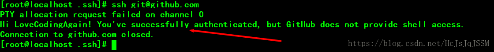
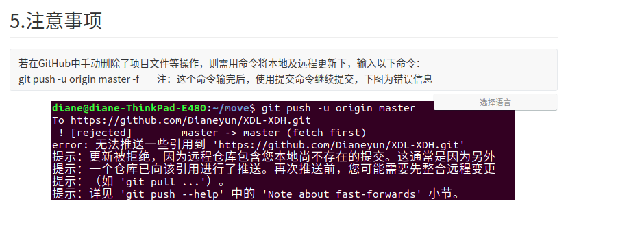

# git

## git hub

### 创建github社区账号

### 创建自己的仓库

> 点击右上角 + 号，选择新存储库选项，然后创建库

### 安装本地git软件

1. 打开终端 输入命令：sudo apt-get install git

2. 验证git是否安装成功，输出命令：git version

3. 配置用户名和邮箱，输入命令：

   > git config --global user.name "用户名"       配置用户名，用户名为上面自己创建的github账号

   > git config --global user.email "邮箱"       	 配置邮箱，确保邮箱存在且正确

4. 配置Git的私钥和公钥，密码为空，输入命令：

   > ssh-keygen -t rsa -C "用户邮箱"
   >
   > 注：出来需要输入的东西，直接回车

5. 证书已经生成成功，进入指定路径下，输入命令：

   > cd ~/.ssh/           :查看是否生成成功

6. 打开github社区，选择头像下的设置选项中的SSH和GPC密钥选项

7. 看到上面的GitHub的ssh配置后，在新建一个ssh key

8. vim打开Git的公钥证书.（在上述查看证书的文件夹下）

   > vim id_rsa.pub

9. 打开证书文件，复制文件中全部的文字，到github中的key中

10. 验证git是否配置成功

    > ssh git@github.com                       ：出现下述话语，配置成功

    

    

11. git创建仓库

    注：在你用户目录中创建一个文件夹，进入之后输入下面命令：

    > git init            注：初始化当前文件夹为Git本地仓库，

    

### git常用命令

---

1. git init -- 初始化本地版本库
 2. git add . -- 跟踪所有改动过的文件

 3. git add <file>  -- 跟踪指定的文件

 4. git commit -m “commit message” -- 提交所有更新过的文件

 5. git push origin <本地分支名>:<远程分支名>  推送本地提交数据到远程仓库指定分支

### git命令

---

1. git checkout -b 分支名    创建切换分支

2. git branch   查看当前所在分支

3. git checkout 分知名   切换分支

4. git merge <branch>   合并指定分支到当前分支

5. git fetch -a 从远程获取最新版本到本地

6. 若在github中手动删除了项目文件等操作，则需用命令将本地及远程更新下，输入以下命令：git push -u origin master -f    注：这个命令输完后，使用提交命令继续提交，下图为错误信息

7. 

8. 忽略add已经添加到缓存区的文件

   > git rm -r --cached 文件名