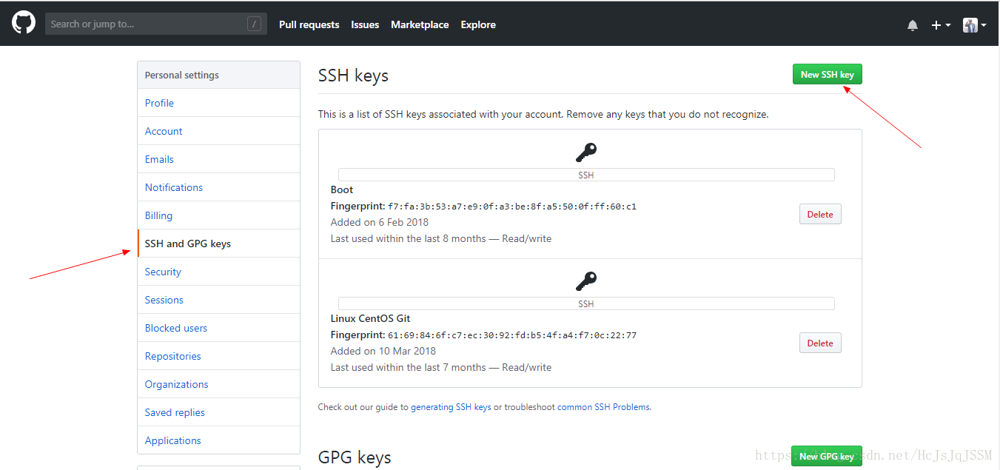
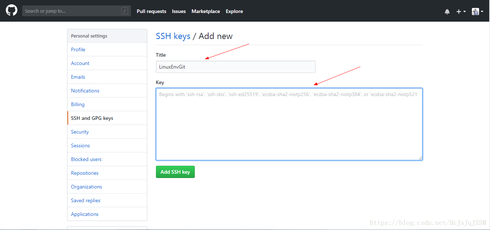
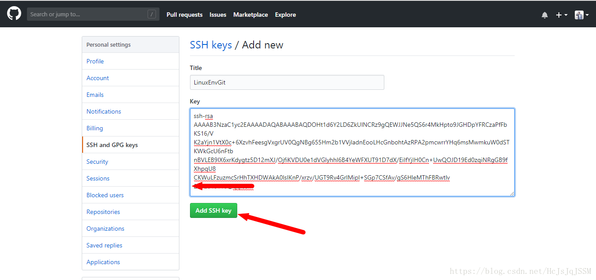

# git  / git hub

## 1.创建github社区账号

### 	通过百度搜索github 进入到git社区中，创建自己的账号

## 2.创建自己的仓库

### 	点击右上角+号，选择新存储库选项，然后创建库

​	

### 3.安装本地git软件

### 		3.1.打开终端  输入命令：sudo apt-get install git

### 		3.2.验证git是否安装成功，输出命令：git version

### 		3.3.配置用户名和邮箱，输入命令：	

```
git config --global user.name "XXXX"         配置用户名，用户名为上面自己创建的github的账号
git config --global user.email  "XXXXXXXXXX"    配置邮箱，确保邮箱存在且正确
```

### 		3.4.查看是否配置成功，输入命令：git config --list

### 		3.5.配置Git的私钥和公钥.密码为空.  输入命令：

```
	ssh-keygen -t rsa  -C "用户邮箱"      注：出来需要输入的东西，直接回车
```

### 		3.6.证书已经生成成功，进入指定路径下，输入命令：

```
cd ~/.ssh/                                    ：查看是否生成成功
```

### 		3.7.打开github社区，选择头像下的设置选项中的SSH和GPC密钥被选项

​	

### 		3.8.看到上面的GitHub的SSH配置后,在新建一个SSH Key.

​		

### 		3.9.vim 打开Git的公钥证书.(在上述查看证书的文件夹下)

```
vim id_rsa.pub         
```

### 		3.10.打开证书文件，复制文件中全部的文字，到GitHub中的key中	

​		注：无需换行

### 		3.11.验证Git是否配置成功

```
ssh git@github.com                       ：出现下述话语，配置成功
```


## 4.Git创建仓库

注：在你用户目录中创建一个文件夹，进入之后输入下面命令：

```
git init            注：初始化当前文件夹为Git本地仓库，
```

